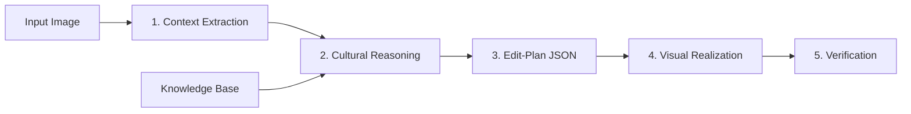

<div align="center">

#  Image Transcreation Pipeline

### A Structured Pipeline for Context-Aware Image Transcreation
*Explicit Reasoning, Cultural Grounding, and Controlled Visual Realization*

[](https://opensource.org/licenses/MIT)
[](https://www.python.org/downloads/)
[](https://www.docker.com/)
[](https://github.com/psf/black)
[](http://makeapullrequest.com)

**Developed by [LightPrism.tech]**

[Quick Start](QUICKSTART.md) • [AI Research](docs/AI.md) • [API Docs](src/perception/README.md) • [Contributing](#contributing)

</div>

---

## Overview

Image transcreation adapts visual content for different cultural contexts while preserving semantic intent and visual coherence. Unlike caption-based or prompt-driven approaches, our framework uses **structured reasoning** to enable interpretable, auditable, and culturally faithful transformations.

### Key Features

- **Structured Approach**: Explicit separation of perception, reasoning, and generation
- **Cultural Intelligence**: Grounded reasoning with auditable knowledge base
- **Full Transparency**: Edit-plan JSON provides complete audit trail
- **Controlled Generation**: Layout-preserving visual realization
- **Verification Built-in**: Automated checks + human-in-the-loop review

---

## Quick Start

```bash
# Docker (recommended)
docker-compose build
docker-compose run perception python -m perception /app/data/input/samples/test.jpg

# Local installation
pip install -r requirements.txt
pip install -e .
python -m perception path/to/image.jpg
```

**Full guide:** [QUICKSTART.md](QUICKSTART.md)

---

## Architecture

Our pipeline separates transcreation into 5 explicit stages:



| Stage | Purpose | Status |
|-------|---------|--------|
| **1. Context Extraction** | Extract structured visual information | Implemented |
| **2. Cultural Reasoning** | Decide what to change using cultural KB | Implemented |
| **3. Edit-Plan Generation** | Create auditable edit instructions | Implemented |
| **4. Visual Realization** | Execute edits with layout preservation | Implemented |
| **5. Verification** | Validate outputs and gather feedback | Planned |

**Technical details:** [docs/AI.md](docs/AI.md)

---

## Project Structure

```
image-transcreation-pipeline/
├── src/
│   └── perception/              # Stage 1: Context Extraction
│       ├── schemas/             # JSON schemas for validation
│       │   ├── object_schema.json
│       │   └── scene_schema.json
│       ├── config/              # Configuration and settings
│       ├── detectors/           # Object and text detection
│       ├── understanding/       # Captioning and attributes
│       ├── ocr/                 # Text extraction
│       └── builders/            # JSON output builders
│   ├── reasoning/               # Stage 2: Cultural Reasoning
│   └── realization/             # Stage 3: Visual Realization
├── data/
│   ├── input/                   # Input images
│   ├── knowledge_base/          # Cultural knowledge graph
│   └── output/
│       └── debug/               # Debug visualizations (bboxes)
├── models/                      # Model weights (auto-downloaded)
├── cache/                       # HuggingFace model cache
├── tests/                       # Unit and integration tests
└── docs/                        # Documentation

**Note:** JSON outputs are returned by the API or saved to user-specified paths, not to `data/output/json/`
```

---

## Installation

### Prerequisites
- Python 3.8+ or Docker
- 8GB+ RAM
- 10GB disk space

### Docker (Recommended)

```bash
docker-compose build
docker-compose up
```

### Local Setup

```bash
# Clone repository
git clone <repository-url>
cd image-transcreation-pipeline

# Install
python -m venv venv
source venv/bin/activate  # Windows: venv\Scripts\activate
pip install -r requirements.txt
pip install -e .
```

---

## Usage

### Command Line

```bash
# Process an image
python -m perception image.jpg

# With custom output
python -m perception image.jpg --output result.json
```

### Python API

```python
from perception.core.pipeline import main

# Process image
result = main("image.jpg")

# Access results
print(result["scene_description"])
print(f"Objects: {len(result['objects'])}")
print(f"Text regions: {len(result['text_regions'])}")
```

### Component-Level API

```python
from perception.detectors import ObjectDetector
from perception.ocr import OCREngine

# Use individual components
detector = ObjectDetector(confidence_threshold=0.5)
objects = detector.detect("image.jpg")

ocr = OCREngine(languages=['en'])
text = ocr.extract_text("image.jpg")
```

**Full API reference:** [src/perception/README.md](src/perception/README.md)

---

## Output Format

### Structured JSON

```json
{
  "image_path": "image.jpg",
  "image_type": "photograph",
  "scene_description": "A bustling city street...",
  "objects": [
    {
      "id": 1,
      "label": "person",
      "confidence": 0.95,
      "bbox": [100, 200, 300, 500],
      "caption": "A person wearing a red jacket",
      "attributes": {"color": "red", "clothing": "jacket"}
    }
  ],
  "text_regions": [
    {"text": "STOP", "confidence": 0.98, "bbox": [50, 50, 150, 100]}
  ]
}
```

**Note:** JSON outputs are returned by the API. To save them, specify `--output` parameter or use the `.save()` method.

### Debug Visualizations

Annotated images with bounding boxes, labels, and confidence scores saved to `data/output/debug/`

---

## Configuration

Create `.env` file:

```bash
# Environment
PERCEPTION_ENV=development
DEBUG=true
LOG_LEVEL=INFO

# Thresholds
OBJECT_THRESHOLD=0.5
TEXT_THRESHOLD=0.6

# Paths
MODELS_DIR=./models
OUTPUT_DIR=./data/output

# Schema validation (auto-configured)
# OBJECT_SCHEMA_PATH=src/perception/schemas/object_schema.json
# SCENE_SCHEMA_PATH=src/perception/schemas/scene_schema.json

# Performance
BATCH_SIZE=1
OCR_GPU=false
```

**All options:** [src/perception/config/settings.py](src/perception/config/settings.py)

---

## Development

### Running Tests

```bash
pytest                              # All tests
pytest tests/unit/                  # Unit tests only
pytest --cov=perception             # With coverage
```

### Code Style

```bash
black src/ tests/                   # Format
flake8 src/ tests/                  # Lint
mypy src/                           # Type check
```

---

## Deployment

### Docker Production

```bash
docker build -t lightprism/image-transcreation:latest .
docker run -d --name transcreation \
  --memory="16g" --cpus="4.0" \
  -v $(pwd)/models:/app/models \
  lightprism/image-transcreation:latest
```

### Cloud Platforms

- **AWS**: ECS/Fargate deployment
- **GCP**: Cloud Run deployment  
- **Azure**: ACI deployment

**Full deployment guide:** [QUICKSTART.md#deployment](QUICKSTART.md)

---

## Roadmap

### Q1 2026
- [COMPLETE] Stage 1: Perception Pipeline
- [COMPLETE] Stage 2: Cultural Reasoning Module
- [COMPLETE] Stage 3: Visual Realization Module
- [IN PROGRESS] Knowledge Base v1.0 (10 cultures)

### Q2-Q4 2026
- [PLANNED] Stages 3-5 implementation
- [PLANNED] End-to-end pipeline integration
- [PLANNED] Knowledge Base v2.0 (50+ cultures)
- [PLANNED] Web UI and Mobile SDK

**Detailed roadmap:** [docs/AI.md#future-directions](docs/AI.md#future-directions)

---

## Contributing

We welcome contributions! Please see our [Contributing Guide](CONTRIBUTING.md) for details on how to set up your development environment, coding standards, and pull request process.

### Quick Steps

1. Fork the repository
2. Create a feature branch (`git checkout -b feature/amazing-feature`)
3. Commit changes (`git commit -m 'Add amazing feature'`)
4. Push to branch (`git push origin feature/amazing-feature`)
5. Open a Pull Request

---

## Documentation

- **[Quick Start Guide](QUICKSTART.md)** - Get running in 3 minutes
- **[AI Research](docs/AI.md)** - Technical foundation and architecture
- **[Perception API](src/perception/README.md)** - Stage 1 implementation details
- **[LICENSE](LICENSE)** - MIT License with trademark notice

---


---

## References

1. **Khanuja et al.** (2024). *Image Transcreation for Cultural Relevance.* arXiv:2404.01247v3
2. **Radford et al.** (2021). *CLIP: Learning Transferable Visual Models.* ICML
3. **Li et al.** (2023). *BLIP-2: Bootstrapping Language-Image Pre-training.* NeurIPS

**Full references:** [docs/AI.md#references](docs/AI.md#references)

---

## License

MIT License - See [LICENSE](LICENSE) for details

**Trademark Notice:** "LightPrism" and "LightPrism.tech" are trademarks of LightPrism.tech

---

## Acknowledgments

- Ultralytics (YOLOv8)
- Salesforce (BLIP)
- OpenAI (CLIP)
- PaddlePaddle (PaddleOCR)
- Stability AI (Stable Diffusion)

---

