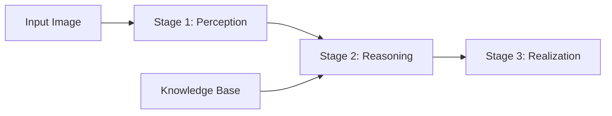

<div align="center">

#  Image Transcreation Pipeline

### A Structured Pipeline for Context-Aware Image Transcreation
*Explicit Reasoning, Cultural Grounding, and Controlled Visual Realization*

[](https://opensource.org/licenses/MIT)
[](https://www.python.org/downloads/)
[](https://www.docker.com/)
[](https://github.com/psf/black)
[](http://makeapullrequest.com)

**Developed by [LightPrism.tech]**

[Quick Start](docs/QUICKSTART.md) • [Reasoning](docs/REASONING.md) • [AI Research](docs/AI.md) • [Perception API](src/perception/README.md) • [Contributing](#contributing)

</div>

---

## Overview

Image transcreation adapts visual content for different cultural contexts while preserving semantic intent and layout. The pipeline is organized as explicit stages: Perception, Reasoning, and Realization.

## Current updates (May 2026)

- **Stage 2: LLM-first reasoning (default)** — LLM proposes culturally appropriate substitutes from scene context; the knowledge graph **grounds** the target to a catalog label before Stage 3. Switch to legacy order with `REASONING_POLICY_REASONING_STRATEGY=kg_first`. See [docs/REASONING.md](docs/REASONING.md).
- **Stage 2: type inference** — Configurable `type_label_cues` and stopword filtering fix mis-typing (e.g. infographic building icons classified as `FOOD`). Perception labels are preserved in `original_object`; grounding hints do not overwrite labels.
- **Stage 3: artifact gate** — Object inpaint outputs are rejected only when truly blank/unchanged (configurable via `data/config/realization_config.json` and `REALIZATION_*` env overrides).
- Unified full-pipeline entrypoint in `src/main.py` (Stages 1–3, or realization-only via `--stage2-json`).
- CLI defaults: `--kg data/knowledge_base/countries_graph.json`, `--output-dir data/output`, `--run-name my_run`; use `--no-cache` after policy or code changes.
- Stage-3 text quality gate with automatic retry; SSIM/CLIP-local off by default for text edits (`quality_gate` in realization config).
- `region_replace` for infographic layouts when object detection is sparse; OCR-driven row inference (no hardcoded weekday lists).

### Key Features (Current)

- Structured 3-stage pipeline with JSON handoff between stages.
- **Hybrid reasoning:** LLM contextual decisions + KB-grounded targets, avoid lists, and visual attributes ([docs/REASONING.md](docs/REASONING.md)).
- Configurable **`llm_first`** vs **`kg_first`** reasoning strategies.
- Infographic-aware type cues, placeholder OCR skipping, and target diversity across regions.
- OCR-region-aware text rewrite with layout and style-family constraints.
- Stage-3 mask-based inpaint (Azure gpt-image / FLUX / diffusers) with artifact and text quality gates.
- Multi-level Stage-3 fallback (bbox overlay, mock text, adaptation label) when inpaint is unavailable.

---

## Quick Start

Compose loads `.env` from the project root. Copy `.env.example` to `.env` and set LLM/API keys before a full run (Stage 2 requires them). With the provided `docker-compose.yml`, downloaded BLIP/CLIP/OWL-ViT, Hugging Face, PyTorch, Ultralytics, and PaddleOCR artifacts persist under `./cache` on the host (see [Installation](#docker-recommended)).

### Docker: full pipeline (Stages 1–3)

From the repository root, put your image under `data/input/...` on the host (mounted at `/app/data` in the container). Outputs are written under `data/output/<run-name>/` on the host.

Full pipeline: only `--img` and `--target` are required. Defaults (from `/app` in the container): `--kg` is `data/knowledge_base/countries_graph.json`, `--output-dir` is `data/output`, `--run-name` is `my_run`. Override any of these only when needed.

```bash
docker-compose build
docker-compose run --rm pipeline python src/main.py \
  --img /app/data/input/samples/your_image.jpg \
  --target India
```

Rebuild the image after changing `Dockerfile`, `requirements.txt`, or Docker build args. Python source changes under `src/` are mounted by Compose and usually do not require a rebuild.

Explicit knowledge graph only (output dir and run name still use defaults):

```bash
docker-compose run --rm pipeline python src/main.py \
  --img /app/data/input/samples/your_image.jpg \
  --target India \
  --kg /app/data/knowledge_base/countries_graph.json
```

One line (all defaults):

```bash
docker-compose run --rm pipeline python src/main.py --img /app/data/input/samples/your_image.jpg --target India
```

Realization-only from an existing Stage-2 JSON (path matches a prior full run under `--run-name`, e.g. `my_run`):

```bash
docker-compose run --rm pipeline python src/main.py \
  --stage2-json /app/data/output/my_run/json/your_image_stage2_reasoning.json
```

Use a different `--run-name` if you want Stage 3 outputs in a separate folder from the default `my_run`.

### Docker: Stage 1 only

```bash
docker-compose build
docker-compose run --rm pipeline python -m perception /app/data/input/samples/testing_image.jpg
# Interactive shell: docker-compose run --rm pipeline /bin/bash
```

### Local

```bash
python -m venv venv
# Windows: venv\Scripts\activate   |   Linux/Mac: source venv/bin/activate
pip install -r requirements.txt
pip install -e .
python src/main.py --img data/input/samples/your_image.jpg --target India
# Optional: --kg, --output-dir (default data/output), --run-name (default my_run)
# Stage 1 only: python -m perception data/input/samples/testing_image.jpg
```

**Full guide:** [docs/QUICKSTART.md](docs/QUICKSTART.md)

---

## Architecture

Current implemented flow:


```mermaid
graph LR
    A[Input Image] --> B[Stage 1: Perception]
    B --> C[Stage 2: Reasoning]
    C --> D[Stage 3: Realization]
    G[Knowledge Base] --> C
```

| Stage | Purpose | Status |
|-------|---------|--------|
| **1. Perception** | Structured scene, OCR, infographic semantics | Implemented |
| **2. Reasoning** | LLM-first (default) or KG-first cultural plan + text rewrite | Implemented |
| **3. Realization** | Inpaint/edit + text rendering + quality gates | Implemented |

**Technical details:** [docs/AI.md](docs/AI.md) · **Reasoning guide:** [docs/REASONING.md](docs/REASONING.md)

---

## Project Structure

```
image-transcreation-pipeline/
├── src/
│   ├── main.py                  # Full pipeline CLI (Stages 1–3, optional Stage 3–only)
│   ├── perception/              # Stage 1: Context Extraction
│   │   ├── schemas/             # JSON schemas for validation
│   │   │   ├── object_schema.json
│   │   │   └── scene_schema.json
│   │   ├── config/              # Configuration and settings
│   │   ├── core/                # Pipeline orchestration
│   │   ├── detectors/           # Object and text detection
│   │   ├── understanding/      # Captioning and attributes
│   │   ├── ocr/                 # Text extraction
│   │   ├── builders/            # JSON output builders
│   │   └── utils/               # Bbox, image load, logging
│   ├── reasoning/               # Stage 2: Cultural Reasoning
│   │   ├── engine.py
│   │   ├── config/reasoning.yaml  # Policy + prompts (llm_first, type cues)
│   │   ├── knowledge_loader.py
│   │   ├── llm_client.py
│   │   ├── main.py
│   │   └── schemas.py
│   └── realization/             # Stage 3: Visual Realization
│       ├── engine.py
│       ├── main.py
│       ├── models.py
│       ├── schema.py
│       └── README.md
├── data/
│   ├── config/                  # realization_config.json (Stage 3 overrides)
│   ├── input/                   # Input images (e.g. input/samples/)
│   ├── knowledge_base/          # Cultural knowledge graph (.json, .pkl, .jsonl)
│   └── output/
│       ├── debug/               # Debug visualizations (bboxes)
│       └── json/                # JSON output when saved via CLI
├── scripts/
│   └── knowledge_graph/         # KG generator (countries.json, generator.py)
├── models/                      # Model weights (auto-downloaded)
├── cache/                       # Hub + PaddleOCR caches (HF_HOME, HOME/.paddleocr; Docker bind-mount)
├── tests/                       # Unit and integration tests
└── docs/                        # Documentation (AI.md, QUICKSTART.md, etc.)
```

Root files: `docker-compose.yml`, `Dockerfile`, `pyproject.toml`, `requirements.txt`, `.env.example` (copy to `.env` for config; Docker loads `.env`).

**Note:** JSON outputs are returned by the API or saved to user-specified paths (e.g. `--output` or `data/output/json/`).

---

## Installation

### Prerequisites
- Python 3.8+ or Docker
- 8GB+ RAM
- 10GB disk space

### Docker (Recommended)

Docker Compose loads your local `.env` file into the container. Create it from the example before the first run:

```bash
# Copy .env.example to .env and edit if needed (API keys, thresholds, etc.)
cp .env.example .env   # Linux/Mac
# Windows: copy .env.example .env

docker-compose build

# Full pipeline (recommended): perception -> reasoning -> realization (defaults: kg, output-dir, run-name)
docker-compose run --rm pipeline python src/main.py --img /app/data/input/samples/your_image.jpg --target India

# Stage 1 only
docker-compose run --rm pipeline python -m perception /app/data/input/samples/testing_image.jpg

# Interactive shell
docker-compose run --rm pipeline /bin/bash
```

**Docker model and hub cache:** Compose mounts `./cache` to `/app/cache`. The Dockerfile and `docker-compose.yml` set `HF_HOME`, `HF_HUB_CACHE`, `TRANSFORMERS_CACHE`, `TORCH_HOME`, `XDG_CACHE_HOME`, `PADDLE_HOME`, `PADDLEOCR_HOME`, `YOLO_CONFIG_DIR`, `MPLCONFIGDIR`, and `HOME` so Hugging Face / Transformers, PyTorch Hub, PaddleOCR, Ultralytics, and related runtime downloads write under that volume. Local weights (YOLO, SAM, etc.) stay under `./models` (`MODELS_DIR`). The first run downloads each missing artifact once; later runs reuse `./cache` and `./models` if you keep those folders. Do not set `HOME`, `HF_HOME`, or related Docker cache variables in `.env` to paths under `/root`, or caches will not persist across containers.

Optional build-time preloading is available via `.env`:

```bash
PRELOAD_BLIP_MODEL=1
PRELOAD_VIT_DETECTOR=1
docker-compose build pipeline
```

Keep these disabled for normal development because they increase image size. Runtime downloads are still cached and reused through `./cache`.

### Local Setup

```bash
# Clone repository
git clone <repository-url>
cd image-transcreation-pipeline

# Install
python -m venv venv
source venv/bin/activate  # Windows: venv\Scripts\activate
pip install -r requirements.txt
pip install -e .
```

---

## Usage

### Full pipeline (CLI)

Runs Stage 1, then Stage 2 (LLM + knowledge graph), then Stage 3 (realization). Use `--no-cache` / `--no-model-cache` to force recomputation; see `python src/main.py --help`.

Required arguments for a full run: `--img` and `--target`. Optional: `--kg` (default `data/knowledge_base/countries_graph.json`), `--output-dir` (default `data/output`), `--run-name` (default `my_run`).

```bash
python src/main.py \
  --img data/input/samples/your_image.jpg \
  --target India
```

Docker (paths inside the container; same defaults under `/app`):

```bash
docker-compose run --rm pipeline python src/main.py --img /app/data/input/samples/your_image.jpg --target India
```

### Command Line (Stage 1)

```bash
# Process an image (output to stdout or --output path)
python -m perception data/input/samples/testing_image.jpg
python -m perception image.jpg --output data/output/json/result.json
```

### Python API

```python
import logging
from perception.main import main

logger = logging.getLogger(__name__)

# Process image
result = main("image.jpg")

# Access results
logger.info("%s", result["scene_description"])
logger.info("Objects: %s", len(result["objects"]))
logger.info("Text regions: %s", len(result["text_regions"]))
```

### Component-Level API

```python
from perception.detectors import ObjectDetector
from perception.ocr import OCREngine

# Use individual components
detector = ObjectDetector(confidence_threshold=0.5)
objects = detector.detect("image.jpg")

ocr = OCREngine(languages=['en'])
text = ocr.extract_text("image.jpg")
```

**Full API reference:** [src/perception/README.md](src/perception/README.md)

---

## Common Commands

| Action | Command |
|--------|---------|
| **Perception (Stage 1)** | `python -m perception data/input/samples/testing_image.jpg` |
| **Perception with output** | `python -m perception image.jpg --output data/output/json/result.json` |
| **Reasoning (Stage 2)** | `python src/reasoning/main.py --input data/output/json/Japan_stage1_perception.json --target India --kg data/knowledge_base/countries_graph.json --output data/output/json/Japan_stage2_reasoning.json` |
| **Realization (Stage 3)** | `python -m src.realization.main --img data/input/samples/Japan.jpg --plan data/output/json/Japan_stage2_reasoning.json --output data/output/final_india.png` |
| **Full pipeline** | `python src/main.py --img data/input/samples/Japan.jpg --target India` (optional: `--kg`, `--output-dir`, `--run-name`; defaults: `data/knowledge_base/countries_graph.json`, `data/output`, `my_run`) |
| **Realization-only from Stage 2** | `python src/main.py --stage2-json data/output/my_run/json/Japan_stage2_reasoning.json` (optional `--output-dir` / `--run-name`; same defaults) |
| **Docker: full pipeline** | `docker-compose run --rm pipeline python src/main.py --img /app/data/input/samples/Japan.jpg --target India` |
| **Docker: realization-only** | `docker-compose run --rm pipeline python src/main.py --stage2-json /app/data/output/my_run/json/Japan_stage2_reasoning.json` |
| **Docker: Stage 1 (perception)** | `docker-compose run --rm pipeline python -m perception /app/data/input/samples/testing_image.jpg` |
| **Docker: shell** | `docker-compose run --rm pipeline /bin/bash` |
| **Regenerate knowledge graph** | `python scripts/knowledge_graph/generator.py` |
| **Tests** | `pytest` or `pytest tests/unit/` |

---

## Output Format

- Stage-1 JSON: perception output (`*_stage1_perception.json`)
- Stage-2 JSON: adapted scene + `edit_plan` + optional `edit_text` + optional `region_replace` (`*_stage2_reasoning.json`)
- Stage-3 image: realized image (`*_stage3_realized.png`)

Stage-2 `edit_plan` action kinds:
- `replace` / `preserve` on detected objects (KG-grounded target).
- `edit_text` on OCR regions with translated strings and preserved style metadata.
- `region_replace` on geometrically-inferred regions (e.g. infographic cells) with a KG-selected target term, used when Stage-1 detection is sparse but OCR anchors exist.

Stage-3 fallback behavior (when no real generated image file is returned):
- If replace actions contain bbox -> draw per-instance replacement overlays.
- Else if `region_replace` entries exist -> overlay the target term into each inferred region.
- Else if `edit_text` exists -> apply bbox text replacements in mock mode with style-family and contrast preservation.
- Else -> apply adaptation label overlay.

Stage-3 text quality gate (see `data/config/realization_config.json -> quality_gate`):
- `text_use_ssim` (default `false`) and `text_use_clip_local` (default `false`) skip image-level similarity checks for text edits.
- Text edits are accepted based on bbox occupancy, contrast ratio, and color delta; one automatic retry is attempted with adjusted font size / color before falling back.

### Debug Visualizations

Annotated images with bounding boxes, labels, and confidence scores saved to `data/output/debug/`

---

## Configuration

Use `.env` for runtime configuration. Recommended Stage-2 setup:

```bash
# Copy template and edit
cp .env.example .env   # Linux/Mac  |  copy .env.example .env   # Windows
```

```env
LLM_PROVIDER=groq
GROQ_API_KEY=your_key
LLM_MODEL=llama-3.3-70b-versatile
REASONING_POLICY_REASONING_STRATEGY=llm_first
```

**Reasoning policy** (full list): [docs/REASONING.md](docs/REASONING.md#configuration). Source: `src/reasoning/config/reasoning.yaml`, overrides via `REASONING_POLICY_*`.

Key variables:

| Variable | Description | Default |
|----------|-------------|---------|
| `PERCEPTION_ENV` | Environment (development/production) | development |
| `DEBUG` | Enable debug output | true |
| `OBJECT_THRESHOLD` | Object detection confidence | 0.5 |
| `TEXT_THRESHOLD` | Text detection confidence | 0.6 |
| `MODELS_DIR` | Model weights directory (YOLO, SAM, …) | ./models |
| `CACHE_DIR` | Application cache directory | ./cache |
| `OUTPUT_DIR` | Output directory | ./data/output |
| `BLIP_MODEL` | BLIP caption/scene model used by Stage 1 | Salesforce/blip-image-captioning-large |
| `CLIP_MODEL` | CLIP model for image-type and semantic analysis | openai/clip-vit-large-patch14 |
| `VIT_DETECTOR_MODEL` | OWL-ViT/open-vocabulary detector model | google/owlv2-large-patch14-ensemble |
| `PRELOAD_BLIP_MODEL` | Docker build-time BLIP preload into image cache (`0`/`1`) | 0 |
| `PRELOAD_VIT_DETECTOR` | Docker build-time open-vocabulary detector preload (`0`/`1`) | 0 |
| `HF_HOME` | Hugging Face root cache (Docker: `/app/cache/huggingface`) | (local default: platform-specific) |
| `HF_HUB_CACHE` | Hugging Face Hub artifact cache (Docker: `/app/cache/huggingface/hub`) | (local default) |
| `TRANSFORMERS_CACHE` | Transformers cache (Docker: `/app/cache/huggingface/transformers`) | (local default) |
| `TORCH_HOME` | PyTorch Hub cache (Docker: `/app/cache/torch`) | (local default) |
| `XDG_CACHE_HOME` | General Linux cache root for libraries (Docker: `/app/cache/xdg`) | (local default) |
| `PADDLE_HOME` | Paddle cache (Docker: `/app/cache/paddle`) | (local default) |
| `PADDLEOCR_HOME` | PaddleOCR cache (Docker: `/app/cache/paddleocr`) | (local default) |
| `YOLO_CONFIG_DIR` | Ultralytics config/cache directory (Docker: `/app/cache/ultralytics`) | (local default) |
| `MPLCONFIGDIR` | Matplotlib config/cache directory (Docker: `/app/cache/matplotlib`) | (local default) |
| `HOME` | In Docker, set to `/app/cache/home` so tools using `~` stay under mounted cache | (your system default) |
| `LLM_PROVIDER` | Reasoning provider (`groq` or `openai`) | groq/openai |
| `GROQ_API_KEY` | Groq API key | (set in .env) |
| `LLM_API_KEY` | Generic key fallback (Groq/OpenAI) | (set in .env) |
| `REASONING_POLICY_REASONING_STRATEGY` | `llm_first` (LLM then KB ground) or `kg_first` | `llm_first` |
| `REASONING_POLICY_GROUNDING_MIN_LABEL_TOKEN_OVERLAP` | Token overlap for label grounding | `1` |
| `REASONING_POLICY_GROUNDING_MIN_EMBEDDING_TOKEN_OVERLAP` | Token overlap for embedding grounding | `2` |

Realization tuning: `data/config/realization_config.json` (merged over `src/realization/config/defaults.yaml`; env prefix `REALIZATION_`).

Object **artifact gate** (reject blank/unchanged inpaint regions):

| Key | Purpose |
|-----|---------|
| `artifact_gate.min_mean_abs_change` | Minimum mean pixel change vs source crop |
| `artifact_gate.min_changed_pixel_ratio` | Fraction of pixels that must change |
| `artifact_gate.min_p95_channel_change` | Strong local change threshold |
| `inpaint_mask_pad_pct` | Mask padding for edits |

Text **quality_gate** in the same file:


| Key | Purpose | Default |
|-----|---------|---------|
| `text_use_ssim` | Enable SSIM check for text edits (usually noisy, off by default) | `false` |
| `text_use_clip_local` | Enable CLIP-local consistency check for text edits | `false` |
| `text_min_occupancy` | Minimum fraction of the text bbox that rendered glyphs must cover | tuned per-config |
| `text_min_contrast` | Minimum foreground/background contrast ratio accepted for a text edit | tuned per-config |
| `text_min_color_delta` | Minimum color delta between rendered text and sampled bg | tuned per-config |

**All options:** [src/perception/config/settings.yaml](src/perception/config/settings.yaml)

---

## Development

### Running Tests

```bash
pytest                              # All tests
pytest tests/unit/                  # Unit tests only
pytest --cov=perception             # With coverage
```

### Code Style

```bash
black src/ tests/                   # Format
flake8 src/ tests/                  # Lint
mypy src/                           # Type check
```

---

## Deployment

### Docker Production

```bash
# Build and tag
docker build -t image-transcreation-pipeline:latest .

# One-off full pipeline (writes to host ./data/output via the data volume)
docker run --rm --env-file .env --memory="16g" --cpus="4.0" \
  -e HF_HOME=/app/cache/huggingface \
  -e HF_HUB_CACHE=/app/cache/huggingface/hub \
  -e TRANSFORMERS_CACHE=/app/cache/huggingface/transformers \
  -e TORCH_HOME=/app/cache/torch \
  -e XDG_CACHE_HOME=/app/cache/xdg \
  -e PADDLE_HOME=/app/cache/paddle \
  -e PADDLEOCR_HOME=/app/cache/paddleocr \
  -e YOLO_CONFIG_DIR=/app/cache/ultralytics \
  -e MPLCONFIGDIR=/app/cache/matplotlib \
  -e HOME=/app/cache/home \
  -v $(pwd)/data:/app/data \
  -v $(pwd)/models:/app/models \
  -v $(pwd)/cache:/app/cache \
  -w /app \
  image-transcreation-pipeline:latest \
  python src/main.py --img /app/data/input/samples/your_image.jpg --target India

# Long-running container (default CMD is bash; override as needed)
docker run -d --name image-transcreation-pipeline \
  --env-file .env \
  --memory="16g" --cpus="4.0" \
  -e HF_HOME=/app/cache/huggingface \
  -e HF_HUB_CACHE=/app/cache/huggingface/hub \
  -e TRANSFORMERS_CACHE=/app/cache/huggingface/transformers \
  -e TORCH_HOME=/app/cache/torch \
  -e XDG_CACHE_HOME=/app/cache/xdg \
  -e PADDLE_HOME=/app/cache/paddle \
  -e PADDLEOCR_HOME=/app/cache/paddleocr \
  -e YOLO_CONFIG_DIR=/app/cache/ultralytics \
  -e MPLCONFIGDIR=/app/cache/matplotlib \
  -e HOME=/app/cache/home \
  -v $(pwd)/data:/app/data \
  -v $(pwd)/models:/app/models \
  -v $(pwd)/cache:/app/cache \
  image-transcreation-pipeline:latest
```

On Windows PowerShell, replace `$(pwd)` with `${PWD}` (or use `%cd%` in `cmd.exe`) for volume paths.

### Cloud Platforms

- **AWS**: ECS/Fargate deployment
- **GCP**: Cloud Run deployment  
- **Azure**: ACI deployment

**Full deployment guide:** [docs/QUICKSTART.md#deployment](docs/QUICKSTART.md)

---

## Current Technical Notes

- **Stage 2 default:** `llm_first` — Groq/OpenAI reasons on scene + object context; KB grounds `target_object` and supplies `visual_attributes`. Use `--no-cache` after changing `reasoning.yaml` or `.env` policy keys.
- **Stage 2 type inference:** `type_label_cues` + stopword-filtered KB token index; `icon`/`symbol` semantic types map to `SYMBOL` when type is ambiguous.
- **Stage 2 legacy:** `REASONING_POLICY_REASONING_STRATEGY=kg_first` restores candidate-list-first behavior.
- Stage-1: infographic icon semantics, OCR style metadata, SAM segmentation when enabled.
- Stage-2: `edit_text`, `region_replace`, placeholder OCR skip, target diversity across objects.
- Stage-3: artifact gate for object edits; text gate with retry; Azure `gpt-image-2` / FLUX / diffusers inpaint paths documented in [src/realization/README.md](src/realization/README.md).

---

## Contributing

We welcome contributions! Please see our [Contributing Guide](CONTRIBUTING.md) for details on how to set up your development environment, coding standards, and pull request process.

### Quick Steps

1. Fork the repository
2. Create a feature branch (`git checkout -b feature/amazing-feature`)
3. Commit changes (`git commit -m 'Add amazing feature'`)
4. Push to branch (`git push origin feature/amazing-feature`)
5. Open a Pull Request

---

## Documentation

- **[Quick Start Guide](docs/QUICKSTART.md)** - Get running in 3 minutes
- **[Reasoning (Stage 2)](docs/REASONING.md)** - LLM-first vs KG-first, type inference, configuration, troubleshooting
- **[AI Research](docs/AI.md)** - Technical foundation and architecture
- **[Perception API](src/perception/README.md)** - Stage 1 implementation details
- **[Reasoning module](src/reasoning/README.md)** - Stage 2 module entry point
- **[Realization](src/realization/README.md)** - Stage 3 visual realization and artifact gate
- **[Knowledge Graph](docs/knowledge_graph.md)** - Knowledge base and generation
- **[LICENSE](LICENSE)** - MIT License with trademark notice

---

## References

1. **Khanuja et al.** (2024). *Image Transcreation for Cultural Relevance.* arXiv:2404.01247v3
2. **Radford et al.** (2021). *CLIP: Learning Transferable Visual Models.* ICML
3. **Li et al.** (2023). *BLIP-2: Bootstrapping Language-Image Pre-training.* NeurIPS

**Full references:** [docs/AI.md#references](docs/AI.md#references)

---

## License

MIT License - See [LICENSE](LICENSE) for details

**Trademark Notice:** "LightPrism" and "LightPrism.tech" are trademarks of LightPrism.tech

---

## Acknowledgments

- Ultralytics (YOLOv8)
- Salesforce (BLIP)
- OpenAI (CLIP)
- PaddlePaddle (PaddleOCR)
- Stability AI (Stable Diffusion)

---

