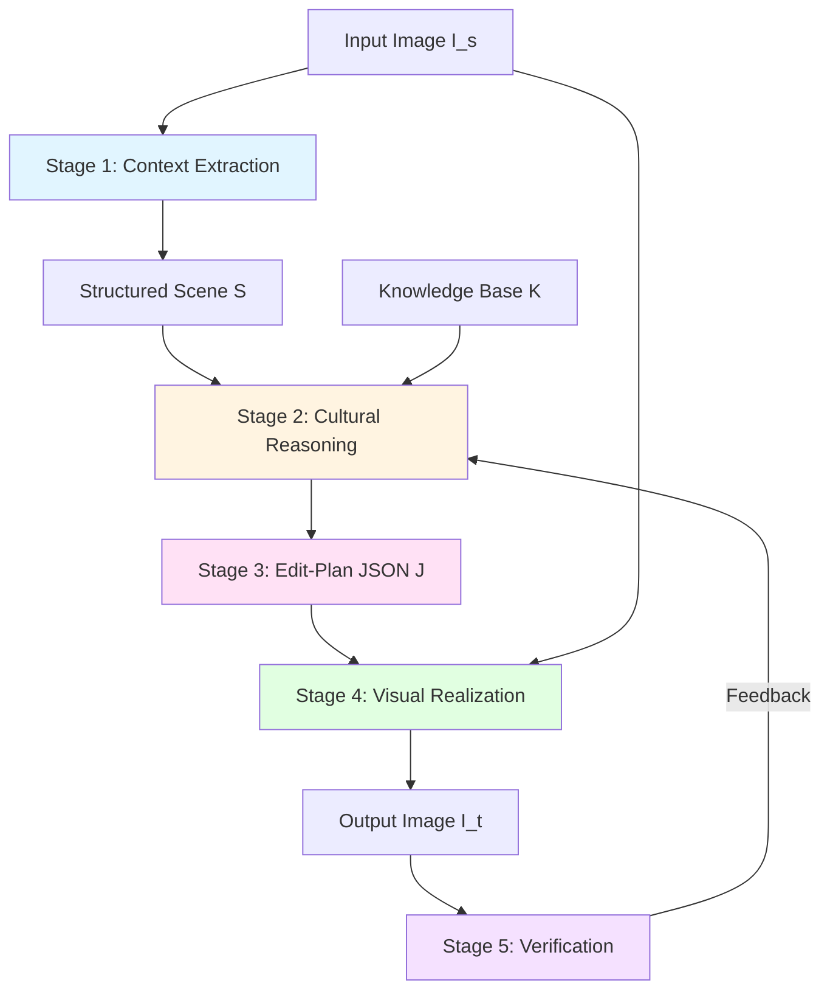
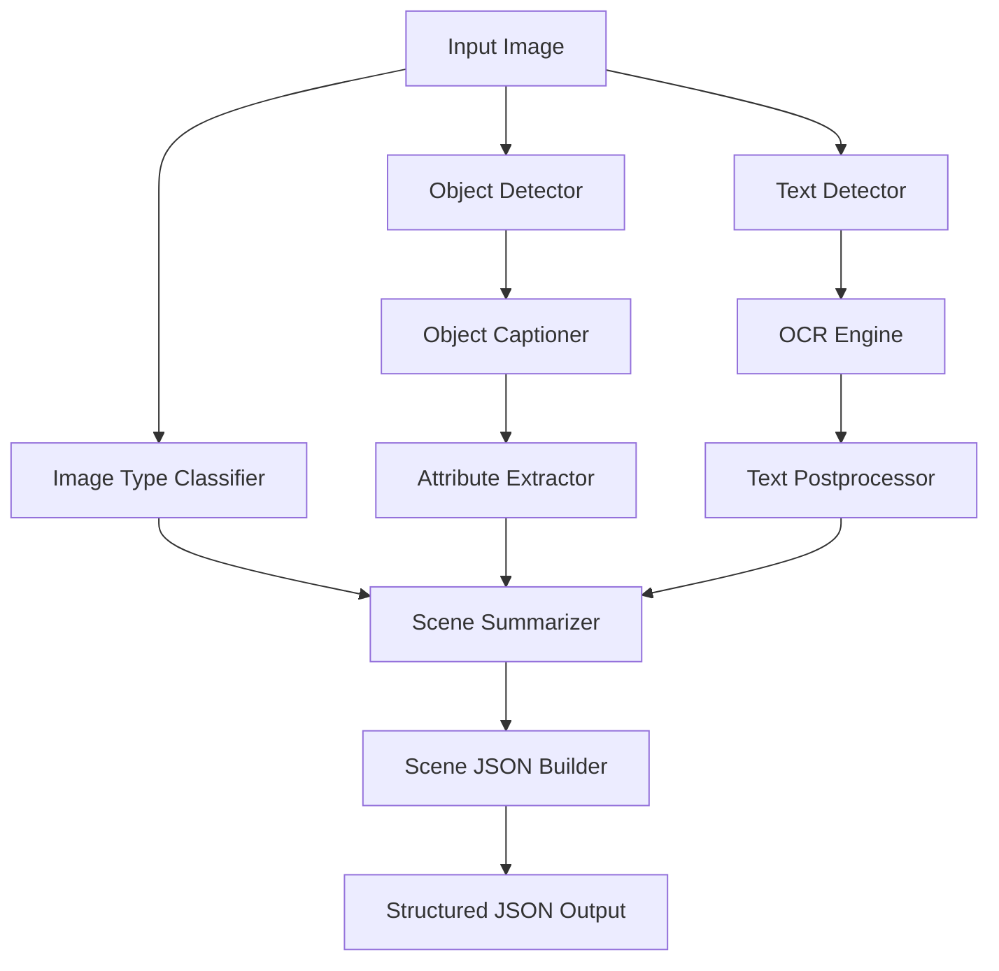

# Image Transcreation: AI Research & Technical Foundation

**A Structured Pipeline for Context-Aware Image Transcreation**  
*Research-backed approach to culturally faithful visual adaptation*

---

## Table of Contents

- [Abstract](#abstract)
- [Research Background](#research-background)
- [Problem Statement](#problem-statement)
- [Proposed Architecture](#proposed-architecture)
- [Pipeline Stages](#pipeline-stages)
- [Knowledge Base Design](#knowledge-base-design)
- [Edit-Plan Specification](#edit-plan-specification)
- [Evaluation Framework](#evaluation-framework)
- [Ethical Considerations](#ethical-considerations)
- [References](#references)

---

## Abstract

Image transcreation aims to adapt visual content for a target cultural context while preserving the original semantic intent, communicative goal, and visual coherence. Recent advances in multimodal generative models have enabled automatic image editing and regeneration; however, existing approaches largely rely on caption-based or prompt-driven pipelines that lack structured visual understanding, explicit cultural reasoning, and controllability.

As demonstrated in recent benchmarks, such systems achieve low cultural alignment and frequently introduce semantic drift, layout distortion, or stereotypical substitutions. In this work, we propose a structured, modular pipeline for context-aware image transcreation that explicitly separates perception, reasoning, and visual realization.

### Key Contributions

1. **Structured visual context extraction** - Object-level semantics with scene graphs
2. **Culturally grounded reasoning** - External knowledge base with avoid lists
3. **Reasoning-driven edit-plan** - JSON control interface for auditability
4. **Context-preserving realization** - Layout-anchored visual generation
5. **Verification framework** - Automated checks + human-in-the-loop

---

## Research Background

### Transcreation as a Concept

The term **transcreation** originates from translation studies, where it refers to adapting content to preserve intent, tone, and cultural resonance rather than literal meaning. Unlike translation, transcreation permits creative modifications as long as the communicative goal is maintained.

Applying this concept to images introduces new complexity, as images encode meaning through visual composition rather than discrete linguistic units.

### Image Transcreation Benchmarks

**Khanuja et al. (2024)** formalized image transcreation as a machine learning task and introduced datasets and evaluation protocols to measure cultural relevance. Their study evaluated several baseline pipelines, including:

- Direct instruction-based editing
- Caption-mediated generation
- Prompt-driven diffusion models

**Key Findings:**
- Best methods achieved cultural alignment in only a small fraction of cases
- Some target cultures showed near-zero success rates
- Common failures: layout drift, semantic inconsistency, stereotyping

### Limitations of Current Approaches

1. **Missing structured visual understanding** - Caption compression loses object identity, relations, and spatial constraints
2. **Poor controllability** - Prompted diffusion introduces unintended changes
3. **Shallow cultural cues** - Systems fall back to stereotypical edits (flags, skin-tone changes)
4. **Lack of transparency** - No verifiable record of intended edits
5. **Data scarcity** - Poor generalization to unseen cultures
6. **Evaluation mismatch** - FID/CLIP don't measure cultural correctness

---

## Problem Statement

Let an input image be **I_s** (source culture implicit or known) and a target culture label be **c_t**. The goal is to generate an output image **I_t** that is culturally adapted for **c_t** while preserving the source intent.

### Three-Way Constraint

1. **Semantic fidelity**: Primary intent and meaning of I_s preserved in I_t
2. **Structural preservation**: Spatial layout, composition, and key geometric relations remain consistent
3. **Cultural relevance**: Culturally salient elements adapted to match norms of c_t, avoiding stereotypes

**Thesis:** A single prompt-to-image step is poorly suited to satisfy these constraints simultaneously. The system must explicitly represent:
- Structured visual context
- Grounded cultural rules
- Controllable edit specification

---

## Proposed Architecture



### Design Principles

1. **Modularity**: Each stage has clear inputs/outputs and can be debugged independently
2. **Explicitness**: Decisions are recorded in structured formats (JSON, scene graphs)
3. **Grounding**: Cultural knowledge is external and auditable, not implicit in model weights
4. **Controllability**: Edit plans provide fine-grained control over what changes
5. **Verifiability**: Automated and human checks validate outputs against plans

---

## Pipeline Stages

### Stage 1: Structured Context Extraction

**Purpose:** Transform I_s into structured representation S(I_s)

**Components:**

#### Objects and Attributes
- Detect objects with bounding boxes (YOLOv8)
- Extract visual attributes (BLIP-2 captions)
- Identify culturally salient classes: food, clothing, architecture, symbols
- Mark anchor objects that must not drift: faces, bodies, key props

#### Scene Graph Construction
- Build graph G = (V, E) where V = objects, E = relations
- Relations: spatial (on, next to, holding), functional (wearing)
- Purpose: Enforce preservation constraints during editing

#### Text Detection & OCR
- Extract text spans with bounding boxes (PaddleOCR)
- Preserve typography and placement for cultural adaptation

#### Global Style Analysis
- Compute lighting, palette, composition descriptors
- Maintain coherence after edits

**Output:** Structured JSON with objects, relations, text, style

#### Perception Process Flow

The aligned Stage 1 execution flow:



#### Current Implementation Specs

The Stage 1 pipeline is currently implemented with the following production-grade components:

| Component | Model / Method | Implementation Details |
|-----------|----------------|------------------------|
| **Orchestration** | Python 3.8+ | Modular `perception` package with synchronous execution |
| **Object Detection** | **YOLOv8x** | `yolov8x.pt` (Extra Large model) for maximum accuracy. Default confidence threshold: `0.5` |
| **Captioning** | **BLIP** | `Salesforce/blip-image-captioning-base` for dense semantic captioning of cropped object regions |
| **Classification** | **CLIP** | `openai/clip-vit-large-patch14` for zero-shot scene categorization |
| **OCR** | **PaddleOCR** | PP-OCRv4 (English) with angle classification. GPU acceleration optional. |
| **Device Support** | CPU / CUDA | Optimized for CPU inference (ONNX/OpenVINO ready) but supports CUDA if available |

#### Data Flow & Artifacts

The pipeline enforces a strict data separation policy:

```
project_root/
├── data/
│   ├── input/                  # Valid image sources (.jpg, .png, .webp)
│   └── output/
│       └── debug/              # Visualizations (BBox overlays)
└── src/
    └── perception/
        └── schemas/            # SINGLE SOURCE OF TRUTH for Data Contracts
            ├── object_schema.json  # Validates individual object entries
            └── scene_schema.json   # Validates full scene output
```

**Note:** The pipeline does **not** save JSON to disk by default to maintain statelessness. JSON is returned to the caller (API/CLI). CLI users can verify outputs using the `--output` flag.

---

### Stage 2: Cultural Reasoning

**Purpose:** Decide what to change and how, using grounded cultural knowledge

#### Why External Knowledge Base?

- LLMs alone: prone to hallucination and stereotype amplification
- Explicit KB: auditable, correctable, updatable by domain experts
- No retraining needed for cultural knowledge updates

#### Knowledge Base Schema

```json
{
  "culture": "Japan",
  "substitutions": {
    "food": {"burger": "onigiri", "hotdog": "takoyaki"},
    "architecture": {"church": "shinto_shrine"},
    "clothing": {"tshirt": "kimono"}
  },
  "avoid": ["samurai_cliches", "geisha_stereotypes"],
  "style_preferences": {
    "colors": ["soft_pastels"],
    "motifs": ["sakura", "origami"]
  },
  "sensitivity_notes": [
    "Avoid religious symbol substitutions without context",
    "Respect traditional vs modern distinctions"
  ]
}
```

#### Reasoning Process

1. Identify culturally misaligned objects/text from S(I_s)
2. Retrieve candidate substitutes from K(c_t)
3. Filter using avoid lists and context compatibility
4. Decide preservation constraints to prevent drift
5. Output structured edit plan

**Output:** Edit-plan JSON J

---

### Stage 3: Edit-Plan Generation

**Purpose:** Create auditable, structured edit instructions

#### Edit-Plan Schema

```json
{
  "preserve": ["layout", "pose", "lighting", "identity"],
  "replace": [
    {
      "object_id": "obj_001",
      "original": "burger",
      "new": "onigiri",
      "constraints": {
        "preserve_size": true,
        "preserve_orientation": true,
        "bbox": [120, 200, 350, 450]
      }
    }
  ],
  "edit_text": [
    {
      "bbox": [100, 50, 400, 80],
      "original": "Welcome to New York",
      "translated": "東京へようこそ",
      "preserve_typography": true
    }
  ],
  "adjust_style": {
    "palette": "soft_pastel",
    "motifs": ["sakura"],
    "texture": "subtle_grain"
  },
  "reasoning": {
    "why_burger_to_onigiri": "Food localization for Japanese context",
    "why_text_translation": "Language adaptation while preserving meaning"
  }
}
```

#### Benefits

- **Auditability**: Reviewers inspect plans before generation
- **Reproducibility**: Deterministic re-runs with same plan
- **Debuggability**: Separate reasoning failures from generation failures
- **Transparency**: Stakeholders understand what changed and why

---

### Stage 4: Visual Realization

**Purpose:** Execute edit plan with context-preserving regeneration

#### Control Mechanisms

1. **Layout Anchoring**
   - Condition diffusion on structural signals (edges, segmentation, pose maps)
   - Preserve spatial arrangement from scene graph
   - Use ControlNet for layout consistency

2. **Cultural Style Alignment**
   - Culture-conditioned style priors (LoRA adapters)
   - Align texture, palette, motifs with K(c_t)
   - Avoid stereotypical enforcement

3. **Attention-Based Fusion**
   - Localized edits with attention masks
   - Smooth blending into global render
   - Prevent boundary artifacts

#### Why Holistic Regeneration?

- Patch-based editing creates style mismatches
- Full re-render allows coherent integration
- Constraints ensure only planned changes occur

**Models:** Stable Diffusion 2.1 + ControlNet + LoRA

---

### Stage 5: Verification

**Purpose:** Validate outputs against edit plan and gather feedback

#### Automated Verification

| Check | Method | Metric |
|-------|--------|--------|
| Structural Preservation | Bbox IoU, keypoint matching | Layout consistency score |
| Semantic Fidelity | Embedding similarity (anchor regions) | Semantic drift score |
| Text Correctness | OCR re-run, bbox alignment | Text accuracy score |
| Plan Adherence | Compare planned vs actual edits | Edit compliance score |

#### Human-in-the-Loop Review

**Focus areas:**
- Cultural appropriateness
- Sensitivity/stereotype violations
- Intent preservation

**Actionable feedback:**
- KB update (wrong substitution)
- Reasoning prompt update (selection logic)
- Generator tuning (visual quality)

---

## Knowledge Base Design

### Structure

```
knowledge_base/
├── cultures/
│   ├── ja-JP.json          # Japan
│   ├── zh-CN.json          # China
│   ├── ar-SA.json          # Saudi Arabia
│   └── ...
├── avoid_lists/
│   ├── stereotypes.json    # Common stereotypes to avoid
│   └── sensitivities.json  # Cultural sensitivities
└── style_priors/
    ├── palettes.json       # Color palettes by culture
    └── motifs.json         # Cultural motifs and patterns
```

### Curation Process

1. **Expert consultation**: Cultural domain experts provide substitution rules
2. **Community review**: Open review process for transparency
3. **Iterative refinement**: Update based on feedback and evaluation
4. **Version control**: Track changes and rationale

### Avoid Lists

Critical for preventing stereotypical edits:

```json
{
  "global_avoid": [
    "skin_tone_changes_without_context",
    "flag_overlays",
    "cliche_landmarks"
  ],
  "culture_specific": {
    "ja-JP": ["samurai_cliches", "geisha_stereotypes"],
    "zh-CN": ["dragon_overuse", "red_gold_only"],
    "ar-SA": ["desert_only_scenes", "camel_insertion"]
  }
}
```

---

## Edit-Plan Specification

### Formal Schema

```typescript
interface EditPlan {
  preserve: PreserveConstraint[];
  replace: ReplaceOperation[];
  edit_text: TextEdit[];
  adjust_style: StyleAdjustment;
  reasoning: ReasoningTrace;
}

interface PreserveConstraint {
  type: "layout" | "pose" | "lighting" | "identity" | "composition";
  regions?: BoundingBox[];
}

interface ReplaceOperation {
  object_id: string;
  original: string;
  new: string;
  constraints: {
    preserve_size?: boolean;
    preserve_orientation?: boolean;
    preserve_relations?: string[];  // IDs of related objects
    bbox: BoundingBox;
  };
}

interface TextEdit {
  bbox: BoundingBox;
  original: string;
  translated: string;
  preserve_typography?: boolean;
  preserve_style?: boolean;
}

interface StyleAdjustment {
  palette?: string;
  motifs?: string[];
  texture?: string;
  lighting?: string;
}
```

---

## Evaluation Framework

### Metrics

#### 1. Cultural Relevance (Human)
- **Authenticity**: Does the output feel culturally appropriate?
- **Stereotype avoidance**: Are stereotypes avoided?
- **Context fit**: Does it match target culture norms?

**Scale:** 1-5 Likert scale, multiple raters

#### 2. Semantic Fidelity (Human + Automatic)
- **Human**: Does the output preserve original intent?
- **Automatic**: Region-restricted embedding similarity for anchors

#### 3. Structural Preservation (Automatic)
- **Layout IoU**: Bounding box overlap for preserved objects
- **Keypoint consistency**: Pose preservation for humans
- **Scene graph consistency**: Relational structure maintained

#### 4. Plan Adherence (Automatic)
- **Replacement accuracy**: Were planned replacements executed?
- **Preservation accuracy**: Were constraints respected?
- **Unintended changes**: Were there edits not in the plan?

### Benchmarks

1. **Single-object substitutions**: Food, clothing, architecture
2. **Multi-object scenes**: Complex relations and interactions
3. **Text-heavy images**: Posters, signage, advertisements
4. **Sensitive contexts**: Avoid-list enforcement scenarios

### Ablation Studies

- No KB (LLM-only reasoning)
- No edit plan (direct prompting)
- No layout control
- No verification loop

---

## Ethical Considerations

### Risks

1. **Stereotype amplification** if KB is poorly curated
2. **Over-generalization** of cultural rules
3. **Misuse** in political or manipulative content
4. **Marginalization** of subcultures not in KB
5. **Cultural appropriation** if substitutions are insensitive

### Mitigations

- ✅ Explicit avoid lists curated by cultural experts
- ✅ Human-auditable edit plans
- ✅ Culturally diverse review processes
- ✅ Transparent KB documentation and update procedures
- ✅ Community feedback mechanisms
- ✅ Clear usage guidelines and restrictions

### Responsible Use Guidelines

1. **Obtain consent** when adapting copyrighted or personal images
2. **Respect cultural sensitivities** - consult domain experts
3. **Avoid political manipulation** - don't use for propaganda
4. **Provide attribution** - credit original creators
5. **Enable user control** - allow manual review and override

---

## References

### Primary Research

1. **Khanuja, S., et al.** (2024). *An Image Speaks a Thousand Words, but Can Everyone Listen? On Image Transcreation for Cultural Relevance.* arXiv:2404.01247v3.

2. **Radford, A., et al.** (2021). *Learning Transferable Visual Models from Natural Language Supervision.* ICML.

3. **Li, J., et al.** (2023). *BLIP-2: Bootstrapping Language-Image Pre-training with Frozen Image Encoders and Large Language Models.* NeurIPS.

### Related Work

4. **Zhang, L., et al.** (2023). *Adding Conditional Control to Text-to-Image Diffusion Models.* (ControlNet)

5. **Rombach, R., et al.** (2022). *High-Resolution Image Synthesis with Latent Diffusion Models.* CVPR.

6. **Hu, E. J., et al.** (2021). *LoRA: Low-Rank Adaptation of Large Language Models.* ICLR.

---

## Future Directions

### Short-term (2026)
- Expand knowledge base to 50+ cultures
- Implement end-to-end pipeline
- Develop comprehensive evaluation suite
- Release public benchmark dataset

### Medium-term (2027)
- Video transcreation support
- Real-time processing capabilities
- Multi-modal transcreation (image + text + audio)
- Collaborative editing platform

### Long-term (2028+)
- Personalized cultural adaptation
- Cross-cultural dialogue systems
- Automated cultural sensitivity detection
- Global content localization platform

---

## Glossary

| Term | Definition |
|------|------------|
| **Transcreation** | Adapting content to preserve *intent* and *emotional impact* rather than literal translation. |
| **Anchor Object** | A visual element (e.g., a face, specific product) that must strictly preserve its identity during generation. |
| **Scene Graph** | A structured data representation where nodes are objects and edges are spatial/semantic relationships. |
| **Hallucination** | In generative AI, when a model fabricates details not present in the source or contrary to facts. |
| **Cultural Grounding** | Constraining AI generation using explicit, verified cultural knowledge (KB) rather than latent statistical priors. |
| **Layout Anchoring** | Using edge maps or segmentation masks to force the generative model to respect the original image's composition. |

---

**For implementation details, see:**
- [Main README](../README.md)
- [Quick Start Guide](../QUICKSTART.md)
- [Perception Pipeline Documentation](../src/perception/README.md)

**Contact:** research@lightprism.tech
