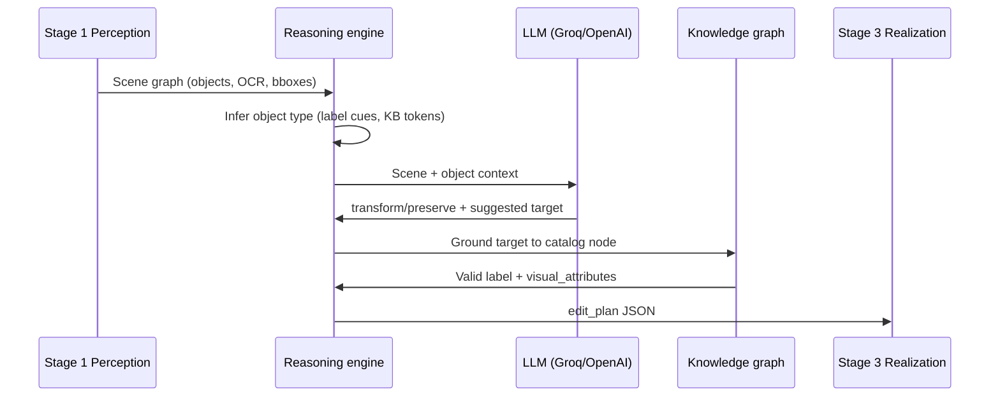

# Stage 2: Cultural Reasoning

Stage 2 turns Stage-1 perception JSON plus a target culture into an **edit plan**: object transformations, preservations, OCR text rewrites, and optional infographic `region_replace` actions.

It uses a **hybrid LLM + knowledge graph (KG)** design: the LLM supplies contextual judgment; the KG supplies a catalog of culturally valid substitutes, avoid lists, style priors, and visual attributes for Stage 3.

---

## End-to-end flow



---

## Reasoning strategies

Controlled by `policy.reasoning_strategy` in `src/reasoning/config/reasoning.yaml` (override with `REASONING_POLICY_REASONING_STRATEGY` in `.env`).

### `llm_first` (default)

1. **LLM** reads scene context and the perception label/caption and proposes `action`, `target_object`, `rationale`, and `confidence` **without** being limited to a pre-built candidate list.
2. **KG** maps the LLM target to a catalog label (exact match, fuzzy match, or embedding nearest neighbor within `type + target_culture`).
3. Stage 3 receives a **grounded** label plus `visual_attributes` from the graph.

**When to use:** Infographics, noisy detector labels, or when you want scene-driven choices (e.g. building → landmark, not a random food item from a bad type guess).

**Logs:**

```text
Reasoning strategy: llm_first for label=illustration_japanese_building
LLM-first KB grounding: label=..., llm_target=Taj Mahal, grounded=Taj Mahal
LLM reasoning result (llm_first): label=..., action=transform, target=Taj Mahal
```

### `kg_first` (legacy)

1. **KG** builds the candidate list for `target_culture` + object type (plus avoid-list filtering and embedding re-rank).
2. **LLM** must pick from that list (prompt includes "you MUST choose one of these if you transform").
3. Normalization snaps free-text LLM output back to a KB candidate.

**When to use:** Maximum catalog safety; smallest risk of LLM inventing off-catalog names (at the cost of weaker scene reasoning when type inference is wrong).

Set in `.env`:

```env
REASONING_POLICY_REASONING_STRATEGY=kg_first
```

---

## Object type inference

Before LLM or KB candidate lookup, each object gets a cultural **type** (`FOOD`, `LANDMARK`, `SYMBOL`, `CLOTHING`, etc.). This drives which slice of the graph is searched.

Priority (highest first):

| Step | Source | Example |
|------|--------|---------|
| 1 | `type_label_cues` in `reasoning.yaml` | `building` in label → `LANDMARK` |
| 2 | KB node on source label | Exact graph match |
| 3 | KB token index (stopword-filtered) | Caption tokens vs graph labels |
| 4 | `semantic_type` fallback | `icon` / `symbol` → `SYMBOL` |

**Important:** Perception labels (e.g. `illustration_japanese_building`) are **never replaced** by grounding hints. Hints only widen KB candidate retrieval.

### Stopwords

Generic tokens (`a`, `and`, `in`, …) are ignored when scoring types and when matching grounding overlap. Without this, many FOOD nodes falsely win because food names share English stopwords with captions.

Config: `policy.type_inference_stopwords` in `reasoning.yaml`.

### Label cues

Keyword → type map for infographic-style detector labels:

```yaml
type_label_cues:
  building: LANDMARK
  ninja: SYMBOL
  sushi: FOOD
  kimono: CLOTHING
```

Extend this file when you add new detector label patterns; no Python change required.

---

## Label grounding (optional hint)

For icons with `detector_caption_mismatch` or `semantic_type: icon|symbol`, the engine may compute a **grounding hint** (KB label) to merge extra candidates. Hints do **not** overwrite the perception `label` used in the edit plan.

Grounding passes:

1. Exact normalized match on label/caption tokens  
2. Token overlap (min `grounding_min_label_token_overlap`, default 1)  
3. Optional embedding rank (min `grounding_min_embedding_token_overlap`, default 2 shared non-stopword tokens)

Disable embedding pass: `use_embedding_label_grounding: false` in policy.

---

## Other Stage-2 features

| Feature | Description |
|---------|-------------|
| **Text rewrite** | OCR regions → `edit_text` with layout-aware length and placeholder skipping (lorem ipsum) |
| **region_replace** | Infographic rows inferred from OCR geometry when object detection is sparse |
| **Avoid lists** | KB + CLI `--avoid`; candidates filtered before LLM/grounding |
| **Target diversity** | `used_targets` deprioritizes repeating the same substitute on multiple regions |
| **Strict mode** | CLI `--strict`; enforces KB-grounded targets and minimum transform density |

---

## Configuration

### Policy file

`src/reasoning/config/reasoning.yaml` → `policy:` section.

| Key | Default | Purpose |
|-----|---------|---------|
| `reasoning_strategy` | `llm_first` | `llm_first` or `kg_first` |
| `type_inference_stopwords` | list | Tokens ignored in type/grounding match |
| `type_label_cues` | map | Keyword → `FOOD` / `LANDMARK` / `SYMBOL` / … |
| `grounding_min_label_token_overlap` | 1 | Token pass for grounding hints |
| `grounding_min_embedding_token_overlap` | 2 | Embedding pass overlap requirement |
| `type_inference_min_token_overlap` | 1 | KB token index type scoring |
| `use_embedding_label_grounding` | true | Enable embedding grounding pass |
| `scope_excluded_types` | COUNTRY, CULTURE | Never use as bbox substitution types |
| `fallback_localized_obj_type` | SYMBOL | Fallback when type unknown |
| `semantic_type_fallbacks` | icon→SYMBOL, … | Perception semantic_type mapping |

### Environment overrides

Prefix: `REASONING_POLICY_` + key in UPPER_SNAKE (see `.env.example`).

```env
REASONING_POLICY_REASONING_STRATEGY=llm_first
REASONING_POLICY_GROUNDING_MIN_LABEL_TOKEN_OVERLAP=1
REASONING_POLICY_GROUNDING_MIN_EMBEDDING_TOKEN_OVERLAP=2
REASONING_POLICY_TYPE_INFERENCE_MIN_TOKEN_OVERLAP=1
```

### LLM provider

```env
LLM_PROVIDER=groq
GROQ_API_KEY=your_key
LLM_MODEL=llama-3.3-70b-versatile
```

Stage 2 does not load vision weights; it runs in the same Docker service as Stages 1 and 3 for path and `.env` consistency.

---

## CLI

```bash
python src/reasoning/main.py \
  --input data/output/my_run/json/japan_stage1_perception.json \
  --target India \
  --kg data/knowledge_base/countries_graph.json \
  --output data/output/my_run/json/japan_stage2_reasoning.json
```

Optional: `--avoid item1 item2`, `--output-dir`, `--run-name`.

Full pipeline (recommended):

```bash
docker-compose run --rm pipeline python src/main.py \
  --img /app/data/input/samples/japan.jpg \
  --target India \
  --no-cache \
  --run-name my_run
```

Use `--no-cache` after changing reasoning policy or perception output so Stage 2 is recomputed.

---

## Output JSON

Stage-2 file includes:

- Adapted `objects` / `scene` / `text` (same schema as Stage 1, culturally updated fields)
- `edit_plan.transformations` / `edit_plan.preservations`
- `edit_text` (OCR rewrites)
- Optional `region_replace` for infographic grids

Each transformation retains `original_object` = **perception label** (e.g. `illustration_japanese_building`) and `target_object` = **grounded KB label** (e.g. `Taj Mahal`).

---

## Troubleshooting

| Symptom | Likely cause | Fix |
|---------|----------------|-----|
| Everything becomes `FOOD` / Chapati | Wrong type inference (stopwords or missing label cue) | Add cue in `type_label_cues`; confirm `type_inference_stopwords`; re-run with `--no-cache` |
| LLM target ignored | Grounding failed, fell back to catalog[0] | Check logs for `LLM-first KB grounding`; widen KB or fix type |
| Stale plan after code change | Stage 2 cache | Delete `*_stage2_reasoning.json` or use `--no-cache` |
| `preserve` for all objects | Empty KB pool for type+culture | Regenerate graph; check `obj_type` in logs |
| Stage 3 replaces with wrong visual | Good plan, bad inpaint | See [realization README](../src/realization/README.md) and `realization_config.json` |

---

## Module map

| File | Role |
|------|------|
| `engine.py` | Policy, type inference, LLM-first / KG-first loops, plan assembly |
| `knowledge_loader.py` | Graph load, candidates, embeddings, avoid/style/sensitivity |
| `llm_client.py` | Provider calls, JSON parsing |
| `policy_config.py` | Load `reasoning.yaml` + env overrides |
| `prompt_config.py` | Prompt templates |
| `config/reasoning.yaml` | Policy + prompts |
| `schemas.py` | Pydantic I/O models |

**Related:** [Knowledge graph](knowledge_graph.md) · [AI architecture](AI.md) · [Quick start](QUICKSTART.md)
