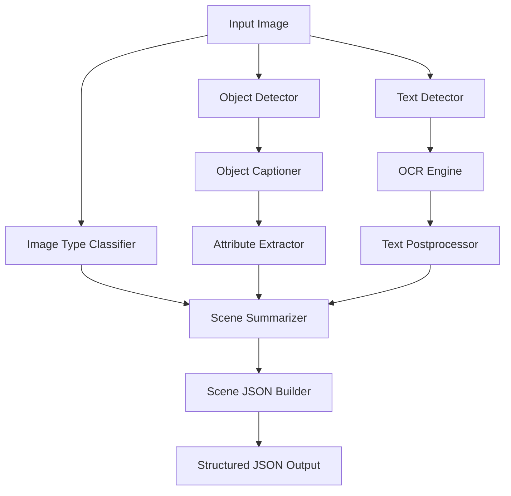

# Perception Package

**Stage-1 Perception Pipeline for Image Transcreation**

Version: 0.1.0

## Overview

The `perception` package is a comprehensive AI-powered image analysis pipeline that extracts structured information from images. It combines multiple computer vision and NLP models to detect objects, recognize text, generate captions, and build structured scene representations.

## Package Structure

```
perception/
├── __init__.py              # Package initialization
├── __main__.py              # CLI entry point
├── core/                    # Core pipeline orchestration
│   ├── __init__.py
│   └── pipeline.py          # Main pipeline logic
├── config/                  # Configuration management
│   ├── __init__.py
│   └── settings.py          # Settings and environment variables
├── detectors/               # Detection modules
│   ├── __init__.py
│   ├── image_type_classifier.py  # Image type classification (CLIP)
│   ├── object_detector.py        # Object detection (YOLOv8)
│   └── text_detector.py          # Text region detection
├── understanding/           # Image understanding modules
│   ├── __init__.py
│   ├── attribute_extractor.py    # Extract object attributes
│   ├── blip_model_manager.py     # BLIP model management
│   ├── object_captioner.py       # Generate object captions
│   └── scene_summarizer.py       # Scene-level summarization
├── ocr/                     # OCR processing
│   ├── __init__.py
│   ├── ocr_engine.py             # PaddleOCR integration
│   └── text_postprocess.py       # Text cleanup and formatting
├── builders/                # Output builders
│   ├── __init__.py
│   ├── scene_graph_builder.py    # Build scene graphs
│   └── scene_json_builder.py     # Build JSON output
└── utils/                   # Utility functions
    ├── __init__.py
    ├── bbox_utils.py             # Bounding box operations
    ├── drawing_utils.py          # Visualization utilities
    ├── image_loader.py           # Image loading and preprocessing
    └── logger.py                 # Logging configuration
```

## Key Components

### 1. Core Pipeline (`core/`)

The main orchestration layer that coordinates all perception modules.

- **`pipeline.py`**: Executes the full perception pipeline from image input to structured JSON output

### 2. Detectors (`detectors/`)

Initial detection and classification modules:

- **`image_type_classifier.py`**: Classifies images using CLIP (e.g., product, lifestyle, fashion)
- **`object_detector.py`**: Detects objects using YOLOv8 with bounding boxes
- **`text_detector.py`**: Identifies text regions in images

### 3. Understanding (`understanding/`)

Deep understanding and caption generation:

- **`blip_model_manager.py`**: Manages BLIP-2 model loading and inference
- **`object_captioner.py`**: Generates detailed captions for detected objects
- **`attribute_extractor.py`**: Extracts attributes (color, material, style, etc.)
- **`scene_summarizer.py`**: Creates overall scene descriptions

### 4. OCR (`ocr/`)

Text extraction and processing:

- **`ocr_engine.py`**: PaddleOCR integration for text recognition
- **`text_postprocess.py`**: Cleans and formats extracted text

### 5. Builders (`builders/`)

Output generation:

- **`scene_json_builder.py`**: Builds structured JSON output conforming to schemas
- **`scene_graph_builder.py`**: Creates scene graph representations

### 6. Utils (`utils/`)

Helper utilities:

- **`bbox_utils.py`**: Bounding box calculations (IoU, cropping, etc.)
- **`drawing_utils.py`**: Visualization tools for debugging
- **`image_loader.py`**: Image loading and preprocessing
- **`logger.py`**: Centralized logging configuration

### 7. Config (`config/`)

Configuration management:

- **`settings.py`**: Centralized settings with environment variable support

## Usage

### As a Python Module

```python
from perception.core.pipeline import main

# Process a single image
main("/path/to/image.jpg", output_path="/path/to/output.json")
```

### Command Line Interface

```bash
# Run the perception pipeline
python -m perception /path/to/image.jpg

# Specify output path
python -m perception /path/to/image.jpg --output /path/to/output.json
```

### Import Specific Components

```python
# Import detectors
from perception.detectors import ObjectDetector, TextDetector, ImageTypeClassifier

# Import understanding modules
from perception.understanding import ObjectCaptioner, AttributeExtractor

# Import OCR
from perception.ocr import OCREngine

# Import utilities
from perception.utils import load_image, draw_bboxes

# Import settings
from perception.config import settings
```

## Configuration

Configuration is managed through `config/settings.py` and can be customized via environment variables:

### Key Settings

```python
# Model paths
YOLO_MODEL_PATH         # YOLOv8 model path
BLIP2_MODEL_NAME        # BLIP-2 model identifier
CLIP_MODEL_NAME         # CLIP model identifier

# Detection thresholds
OBJECT_DETECTION_THRESHOLD = 0.5
TEXT_DETECTION_THRESHOLD = 0.6
CLASSIFICATION_THRESHOLD = 0.7

# Paths
MODELS_DIR              # Model storage directory
OUTPUT_DIR              # Output directory
CACHE_DIR               # Cache directory
```

### Environment Variables

Create a `.env` file in the project root:

```bash
# Model configuration
BLIP_MODEL=Salesforce/blip-image-captioning-base
CLIP_MODEL=openai/clip-vit-large-patch14

# Thresholds
OBJECT_THRESHOLD=0.5
TEXT_THRESHOLD=0.6
CLASSIFICATION_THRESHOLD=0.7

# Paths
MODELS_DIR=./models
OUTPUT_DIR=./data/output
CACHE_DIR=./cache

# Debugging
DEBUG=true
SAVE_DEBUG=true
LOG_LEVEL=INFO

# Performance
BATCH_SIZE=1
OCR_GPU=false
```

## Pipeline Flow



## Output Format

The pipeline generates structured JSON output with:

- **Scene metadata**: Image type, dimensions, overall description
- **Objects**: Detected objects with bounding boxes, labels, captions, and attributes
- **Text**: Extracted text with positions and confidence scores
- **Relationships**: Spatial relationships between objects (optional)

Example output structure:

```json
{
  "scene": {
    "image_type": "product",
    "description": "A modern living room with furniture",
    "dimensions": {"width": 1920, "height": 1080}
  },
  "objects": [
    {
      "id": "obj_001",
      "label": "sofa",
      "bbox": [100, 200, 500, 600],
      "confidence": 0.95,
      "caption": "A gray modern sofa",
      "attributes": {
        "color": "gray",
        "material": "fabric",
        "style": "modern"
      }
    }
  ],
  "text_regions": [
    {
      "text": "SALE 50% OFF",
      "bbox": [800, 100, 1100, 150],
      "confidence": 0.98
    }
  ]
}
```

## Models Used

| Model | Purpose | Framework |
|-------|---------|-----------|
| **YOLOv8x** | Object detection | Ultralytics |
| **BLIP-2** | Image captioning | Transformers |
| **CLIP** | Image classification | Transformers |
| **PaddleOCR** | Text recognition | PaddlePaddle |

## Development

### Running Tests

```bash
# Run all tests
pytest

# Run with coverage
pytest --cov=perception --cov-report=html

# Run specific test file
pytest tests/unit/test_detectors.py
```

### Code Style

The package follows PEP 8 guidelines:

```bash
# Format code
black src/perception

# Lint code
flake8 src/perception

# Type checking
mypy src/perception
```

## Dependencies

Core dependencies:
- `torch` >= 2.0.0 - Deep learning framework
- `torchvision` >= 0.15.0 - Vision utilities
- `ultralytics` == 8.0.196 - YOLOv8 implementation
- `transformers` == 4.36.2 - BLIP-2 and CLIP models
- `paddlepaddle` >= 2.5.0 - PaddleOCR backend
- `paddleocr` == 2.7.0.3 - OCR engine
- `opencv-python` >= 4.5.0 - Image processing
- `Pillow` >= 9.0.0 - Image handling
- `numpy` >= 1.21.0 - Numerical operations

See `pyproject.toml` for complete dependency list.

## Performance Considerations

### CPU Optimization

The pipeline is optimized for CPU execution:

```bash
export OMP_NUM_THREADS=4
export MKL_NUM_THREADS=4
export FLAGS_use_mkldnn=false
```

### GPU Support

To enable GPU acceleration (if available):

```bash
export OCR_GPU=true
```

Ensure you have CUDA-compatible PyTorch and PaddlePaddle installed.

## Troubleshooting

### Common Issues

**1. Model Download Failures**
- Check internet connection
- Verify Hugging Face Hub access
- Check cache directory permissions

**2. Out of Memory**
- Reduce batch size: `BATCH_SIZE=1`
- Use smaller models
- Process smaller images

**3. PaddleOCR Errors**
- Disable MKL: `FLAGS_use_mkldnn=false`
- Check model cache: `~/.paddleocr/`

**4. Import Errors**
- Ensure package is installed: `pip install -e .`
- Check Python path includes `src/`

## License

MIT License

## Contributing

Contributions are welcome! Please ensure:
1. All tests pass
2. Code follows PEP 8 style
3. Documentation is updated
4. Type hints are included

## Support

For issues and questions, please refer to the main project README or create an issue in the repository.
